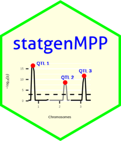

<!-- README.md is generated from README.Rmd. Please edit that file -->

```{r, include = FALSE}
knitr::opts_chunk$set(
  collapse = TRUE,
  comment = "#>",
  fig.path = "man/figures/README-",
  out.width = "100%"
)
```

# statgenMPP 

[](https://www.r-pkg.org/pkg/statgenMPP)
[](https://www.r-pkg.org/pkg/statgenMPP)
[](https://github.com/Biometris/statgenMPP/actions?workflow=R-CMD-check)
[](https://app.codecov.io/gh/Biometris/statgenMPP)

The statgenMPP package is developed as an easy-to-use package for QTL mapping in biparental and multi-parent populations. The package has many ways of visualizing inputs and results. First Identity By Descent (IBD) probabilities are computed using Hidden Markov Models. These probabilities are then used in a mixed model approach for QTL Mapping as described in [Li et al. 2021](https://link.springer.com/article/10.1007/s00122-021-03919-7).


* Install from CRAN:

```{r, eval = FALSE}
install.packages("statgenMPP")
```

* Install latest development version from GitHub (requires [remotes](https://github.com/r-lib/remotes) package):

```{r, eval = FALSE}
remotes::install_github("Biometris/statgenMPP", ref = "develop", dependencies = TRUE)
```

## Example

Here we give a simple example, using a single biparental population. The example contains simulated data for one F4DH population. The population type F4DH is a cross between two parents, A and C, followed by 3 generations of selfings, followed by a DH generation, see [statgenIBD](https://biometris.github.io/statgenIBD/) for details.

First we load the marker data and phenotypic data and calculate the IBDs using the `calcIBDMPP` function:

```{r simIBD}
library(statgenMPP)

markerFiles <- system.file("extdata/multipop", "AxC.txt", 
                             package = "statgenMPP")
mapFile <- system.file("extdata/multipop", "mapfile.txt",
                       package = "statgenMPP")
phenoDat <- read.delim(system.file("extdata/multipop", "AxBxCpheno.txt",
                                   package = "statgenMPP"))

ACMPP <- calcIBDMPP(crossNames = c("AxC"),  
                     markerFiles = markerFiles,
                     pheno = phenoDat,
                     popType = "F4DH",
                     mapFile = mapFile,
                     evalDist = 5)
```

The population has the following simple structure, for more complicated examples see the vignette.

```{r plotPACMPP}
plot(ACMPP, plotType = "pedigree")
```

The next step is to select QTLs using `selQTLMPP`:

```{r ACMQM}
ACMQM <- selQTLMPP(MPPobj = ACMPP, trait = "yield", threshold = 3)
```

The QTL-mapping profile and parental effects:

```{r plotQPEACMQM}
plot(ACMQM, plotType = "QTLProfileExt")
```

The confidence intervals around the parental effects for each QTL:
```{r plotCIACMQM}
plot(ACMQM, plotType = "parCIs")
```

A summary of the QTL-analyis gives a short overview containing the total number of markers and the number of QTLs found. Also for all QTLs their position on the chromosome is shown as well as the nearest marker on the original map, the explained variance, and the effects and the standard errors of all parents:

```{r sumACMQM}
## Print summary
summary(ACMQM)
```

