# QTL Mapping in Multi-Parent Populations

## The statgenMPP package

The `statgenMPP` package is developed as an easy-to-use package for QTL
mapping in biparental and multi-parent populations. The package has many
ways of visualizing inputs and results.

This vignette describes in detail how to perform the IBD calculations
and how to do QTL mapping using the IBD probabilities in a linear mixed
model framework, see Li et al. ([2021](#ref-Li2021)) and Li et al.
([2022](#ref-Li2022)) for details. The Linear Model Equations are solved
using the [LMMsolver](https://biometris.github.io/LMMsolver/) R package
([Boer 2023](#ref-boer2023)). This will be illustrated using three
example data sets. The first data set is a simulated NAM data set with
three parents, that is relatively small and runs fast and is mainly used
to show the functionality of the package. Then two data sets from
literature are used to show the validity of the results from the
package, first a maize data set, the dent panel of the EU-NAM maize
project (Giraud et al. ([2014](#ref-Giraud2014))). The second data set
is a barley data set for awn length described in Liller et al.
([2017](#ref-Liller2017-jz)).

## Example simulated data

As a first example for performing IBD calculations and QTL mapping for a
multi-parent population we use a relatively simple simulated data set.
The example contains simulated data for two F4DH populations. The
population type F4DH is cross between two parents, followed by 3
generations of selfings, followed by a DH generation, see
[statgenIBD](https://biometris.github.io/statgenIBD/) for details.

For the first population the parents where A and B, for the second the
parents where A and C. The first population consists of 100 individuals,
the second of 80 individuals. This is a simple example of a NAM
population, having parent A as central parent. The data is simulated
with three QTLs, on chromosome 1, 2, and 3. All necessary data for this
population is available in the package.

Before doing QTL detection we compute IBD probabilities on a grid of
positions along the genome. This can be done using the `calcIBDMPP`
function in the `statgenMPP` package. To perform IBD calculations a
marker file is required for each of the populations. These files should
be a tab-delimited file with first column ID identifying the genotype.
The following columns should contain marker information. The first rows
should contain the parents used in the cross. As an example, the file
for the first cross, AxB, starts like this:

| ID      | M1_1 | M1_2 | M1_3 | M1_4 |
|:--------|-----:|-----:|-----:|-----:|
| A       |    1 |    2 |    2 |    2 |
| B       |    2 |    2 |    2 |    1 |
| AxB0001 |    1 |    2 |    2 |    1 |
| AxB0002 |    2 |    2 |    2 |    2 |

In this example markers M1_1 and M1_4 are segregating in the AxB cross,
M1_2 and M1_3 not.  
A map file is also required. This should also be a tab-delimited file
with three columns, “marker name”, “chromosome” and “position”. The map
file cannot contain a header and has to be identical for all crosses.

Phenotypic data can be added as a `data.frame` when computing IBD
probabilities. Such a `data.frame` should have a first column “genotype”
and all other columns have to be numerical. For the simulated NAM
population the `data.frame` with phenotypic data starts like this:

| genotype | yield |
|:---------|------:|
| AxB0001  |  9.89 |
| AxB0002  |  6.55 |
| AxB0003  |  7.90 |
| AxB0004  |  4.46 |
| AxB0005  |  5.21 |
| AxB0006  |  5.27 |

The phenotypic data only contains a single trait, yield. When performing
IBD calculations and specifying phenotypic data, the phenotypic data
will be combined with computed IBD probabilities. For this, the genotype
specified in the ID column in the marker file(s) will be matched with
the genotype in the genotype column in the `data.frame` with phenotypic
information. Phenotypic data for all crosses can either be added from a
single `data.frame` containing phenotypic data for all crosses, or a
`list` of `data.frames` each containing phenotypic data for a single
cross.

``` r

## Specify files containing markers.
# One file for each of the two crosses.
markerFiles <- c(system.file("extdata/multipop", "AxB.txt", 
                             package = "statgenMPP"),
                 system.file("extdata/multipop", "AxC.txt", 
                             package = "statgenMPP"))

## Specify file containing map.
# Both crosses use the same map file.
mapFile <- system.file("extdata/multipop", "mapfile.txt",
                       package = "statgenMPP")

## Read phenotypic data
phenoDat <- read.delim(system.file("extdata/multipop", "AxBxCpheno.txt",
                                   package = "statgenMPP"))
# Check contents.
head(phenoDat)
#>   genotype yield
#> 1  AxB0001  9.89
#> 2  AxB0002  6.55
#> 3  AxB0003  7.90
#> 4  AxB0004  4.46
#> 5  AxB0005  5.21
#> 6  AxB0006  5.27

## Perform IBD calculations. 
ABCMPP <- calcIBDMPP(crossNames = c("AxB", "AxC"),  
                     markerFiles = markerFiles,
                     pheno = phenoDat,
                     popType = "F4DH",
                     mapFile = mapFile,
                     evalDist = 5)
```

With `calcIBDMPP` IBD probabilities are computed on a grid for each of
the crosses separately and then combined into a single output object.
The value of `evalDist` can be used to specify the maximum distance (in
cM) between two evaluation points on the grid. The exact distance
depends on the length of the chromosomes. The output is stored in an
object of class `gDataMPP` (genomic Data for Multi Parent Populations)
in which information about map, markers, and phenotypic data is
combined. With the `summary` function we can get some insight in this
information.

``` r

## Print summary
summary(ABCMPP)
#> map
#>  Number of markers: 95 
#>  Number of chromosomes: 5 
#> 
#> markers
#>  Number of markers: 95 
#>  Number of genotypes: 180 
#>  Parents: A, B, C 
#> pheno
#>  Number of traits: 1 
#>  Traitnames: yield 
#>  Number of genotypes: 180 
#> 
#> crosses          
#>  AxB:100  
#>  AxC: 80
```

To get a further idea about the population and the computed IBD
probabilities we can visualize the results. First we have a look at
structure of the pedigree of the population using
`plotType = "pedigree"` to get a general idea of what the design looks
like.

``` r

## Plot structure of the pedigree.
plot(ABCMPP, plotType = "pedigree")
```

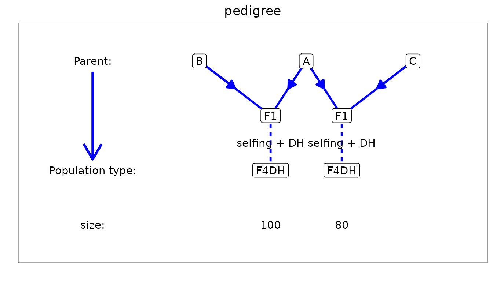

Next we look at the genetic map using `plotType = "genMap"`. This will
display the genetic map of the population showing the length of each of
the chromosomes and indicating the positions where the IBD probabilities
were calculated. Optionally it is possible to highlight one or more
markers using `highlight` argument.

``` r

## Plot genetic map.
# Highlight marker on chromosome 3 at position 40.
plot(ABCMPP, plotType = "genMap", highlight = "EXT_3_40")
```

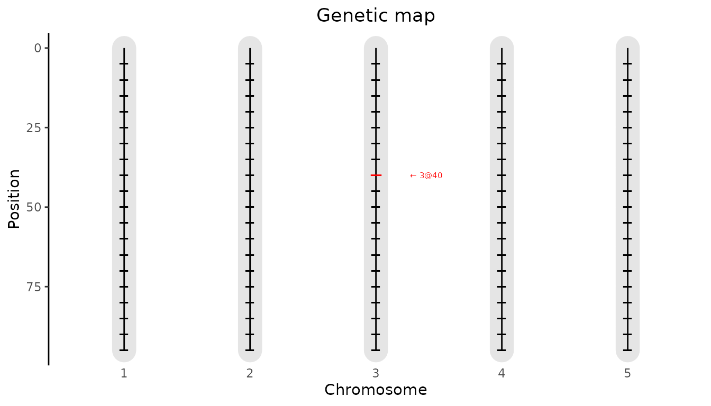

Finally we visualize the computed IBD probabilities across the genome
for a selected genotype using `plotType = "singleGeno"`. This plot will
show the IBD probabilities for all parents for all positions on the
genome for the selected genotype.

``` r

## Plot IBD probabilities for genotype AxB0001.
plot(ABCMPP, plotType = "singleGeno", genotype = "AxB0001")
```

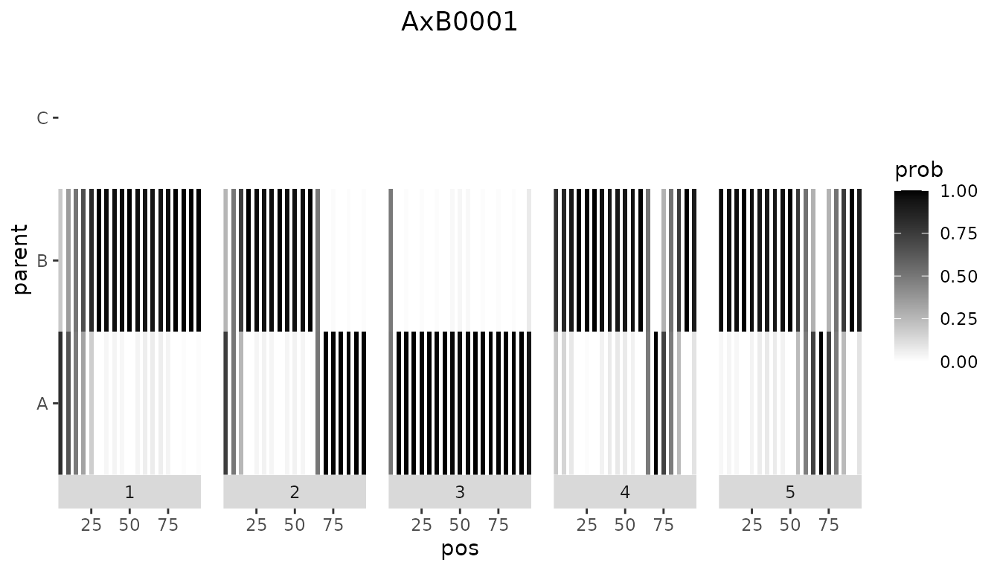

Using the computed IBD probabilities we can now do the actual QTL
Mapping using the `selQTLMPP` function. First we perform a SQM by
setting `maxCofactors = 0`. Our trait of interest, yield, is specified
in the `trait` argument of the function.

``` r

## Perform Single-QTL Mapping.
ABCSQM <- selQTLMPP(MPPobj = ABCMPP,
                    trait = "yield",
                    maxCofactors = 0)
```

The results of the SQM can be plotted using the `plot` function with
`plotType = "QTLProfile"`.

``` r

## Plot QTL Profile for ABC SQM.
plot(ABCSQM, plotType = "QTLProfile")
```

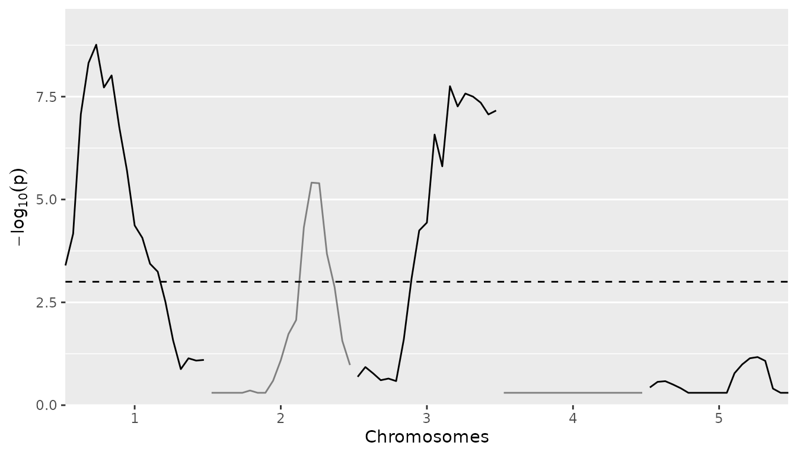

Already from the SQM the position of the three simulated QTLs is quite
clear. We can get an even better result using MQM. For that, again we
use the `selQTLMPP` function. We don’t specify the `maxCofactors` to let
the algorithm determine the number of cofactors based on the threshold
and QTLwindow. As long as new markers are found with a $`-log10(p)`$
value above `threshold` and the maximum number of cofactors is not
reached, a new round of scanning is done. In the new round of scanning
the marker with the highest $`-log10(p)`$ value from the previous round
is added to the cofactors. Based on the profile plot for the SQM the
`threshold` is set to 3. The `QTLwindow` is not specified and therefore
left at its default value of 10cM.

``` r

## Perform Multi-QTL Mapping.
ABCMQM <- selQTLMPP(MPPobj = ABCMPP,
                    trait = "yield",
                    threshold = 3)
```

It is possible to include a polygenic term in the model to control for
background genetic information. To do this a list of chromosome specific
kinship matrices can either be computed by the `selQTLMPP` function or
specified by the user. In the former case it is enough to specify
`computeKin = TRUE`. When doing so the kinship matrix is computed by
averaging $`Z Z^t`$ over all markers, where $`Z`$ is the genotype
$`\times`$ parents matrix with IBD probabilities for the marker. A list
of precomputed chromosome specific kinship matrices can be specified in
`K`. Note that adding a kinship matrix to the model increases the
computation time a lot, especially for large populations. It is
advisable to use parallel computing when doing so (see [Parallel
computing](#parCom)).

``` r

## Perform Multi-QTL Mapping.
# Compute kinship matrices.
ABCMQM_kin <- selQTLMPP(MPPobj = ABCMPP,
                        trait = "yield",
                        threshold = 3,
                        computeKin = TRUE)
```

Next we can visualize the results. First we plot the positions of the
QTLs found on the genetic map. This will produce a plot similar the the
genetic map plot we have seen before, but now the QTLs will be
highlighted. This plot can be made by specifying
`plotType = "QTLRegion"`

``` r

## Plot QTL Profile for ABC MQM.
plot(ABCMQM, plotType = "QTLRegion")
```

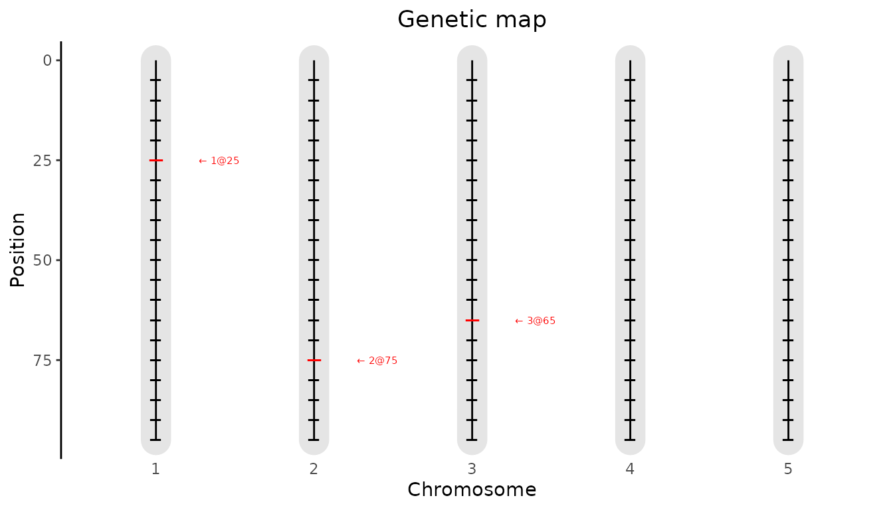

As for the SQM we can also plot the QTL profile. The QTLs found will be
highlighted in the profile in red.

``` r

## Plot QTL Profile for ABC MQM.
plot(ABCMQM, plotType = "QTLProfile")
```

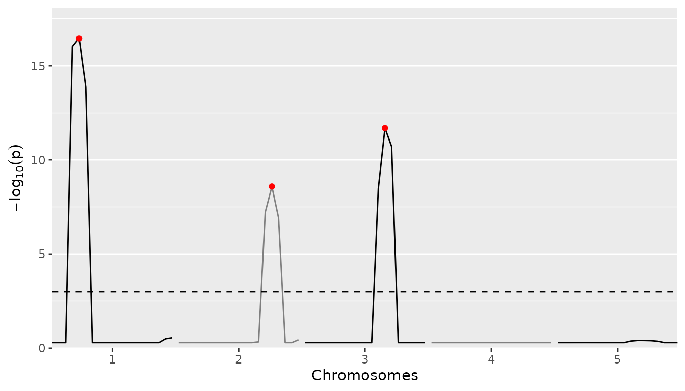

It is also possible to plot the size of the parental effects for each of
the QTLs found. Positive effects of a parent on the trait will be
indicated by shades of red, negative effects by shades of blue. The
stronger the color, the larger the effect for the specific parent is.
This plot can be made using `plotType = "parEffs"`.

``` r

## Plot QTL Profile for ABC MQM.
plot(ABCMQM, plotType = "parEffs")
```

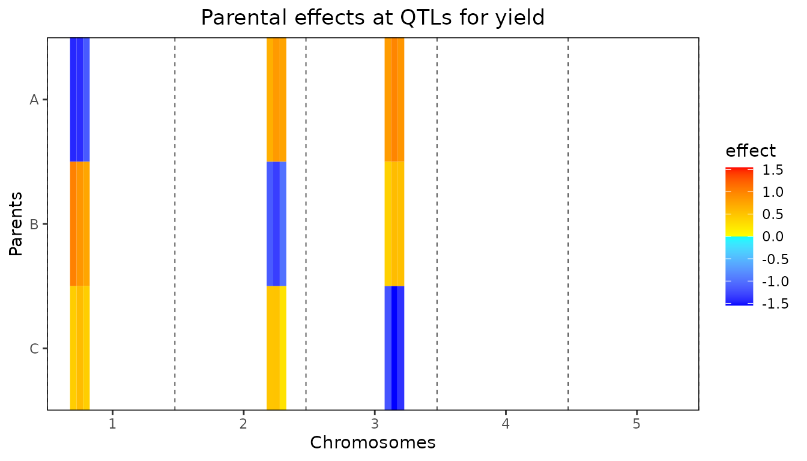

Also a combined plot of the QTL profile and the parental can be made. In
this plot the two previous plots are plotted above each other with the
chromosomes and positions aligned to allow for easily getting an
overview of which effect belongs to which QTL in the QTL profile. This
plot can be made using `plotType = "QTLProfileExt"`.

``` r

## Plot QTL Profile for ABC MQM.
plot(ABCMQM, plotType = "QTLProfileExt")
```

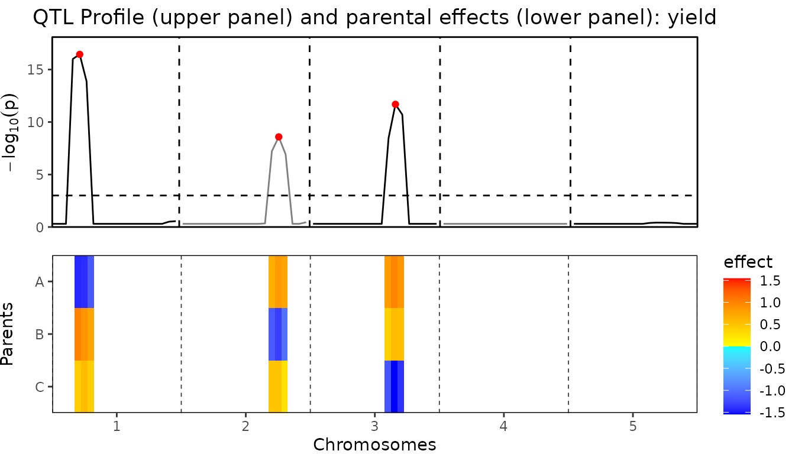

Finally a plot of the confidence intervals around the estimated parental
effects can be made for each of the QTLs found. This plot can be made
using `plotType = "parCIs"`. The plot will show per QTL the effects for
each of the parents, as well as the confidence intervals around those
effects (calculated as $`2 \times se`$). Confidence intervals that don’t
contain the origin, are assumed to be significant and are shown in red
for positive effects and in blue for negative effects. All other
intervals are shown in black.

``` r

## Plot confidence intervals for parental effects for ABC MQM.
plot(ABCMQM, plotType = "parCIs")
```

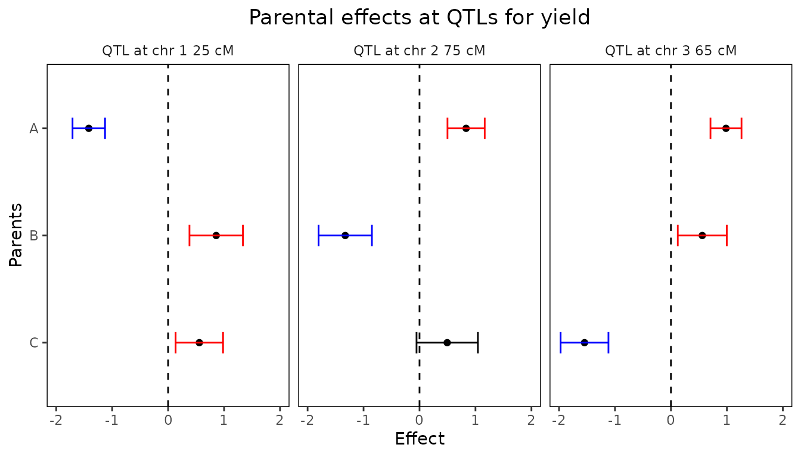

A summary of the QTL-analysis gives a short overview containing the
total number of markers and the number of QTLs found. Also for all QTL
their position on the chromosome is shown as well as the nearest marker
on the original map, the explained variance and the effects and the
standard errors of all parents.

``` r

## Print summary
summary(ABCMQM)
#> Trait analysed: yield 
#> 
#> Data are available for 95 markers.
#> Threshold: 3 
#> 
#> Number of QTLs: 3 
#> 
#>   evalPos chr pos mrkNear minlog10p varExpl  eff_A  eff_B  eff_C se_eff_A se_eff_B
#>  EXT_1_25   1  25    M1_3     16.45   0.242 -1.417  0.859  0.558    0.145    0.239
#>  EXT_2_75   2  75    M2_8      8.59   0.217  0.833 -1.327  0.495    0.166    0.238
#>  EXT_3_65   3  65    M3_7     11.69   0.287  0.984  0.560 -1.544    0.139    0.219
#>  se_eff_C
#>     0.212
#>     0.274
#>     0.214
```

From the output of `selQTLMPP` the p-Values and effects for all markers
can be extracted. They are stored in a `data.table` within the output
object. The example below shows how to extract them. The output will
contain columns evalPos, chr and pos with name, chromosome number and
evaluation position and columns pValue and eff_par1, eff_par2, eff_par..
with the effects of all parents for that marker.

``` r

## Extract results of QTL mapping.
ABCMQMres <- ABCMQM$GWAResult$yield
head(ABCMQMres[, 1:8])
#> NULL
```

It is also possible to only extract the markers that are either QTLs or
within the window of one of the selected QTLs, as specified when calling
the `selQTLMPP` function. As for the full results, this information in
stored in the output as a `data.table` that can be extracted as shown
below. The columns in this `data.table` are identical to those in the
full results except for an additional column at the end, snpStatus, that
shows whether a marker is a QTL or within the window of a QTL.

``` r

## Extract QTLs and markers within QTL windows.
ABCMQMQTL <- ABCMQM$signSnp$yield
head(ABCMQMQTL[, c(2:8, 10)])
#> NULL
```

## Example maize

As a second example we use data from a maize NAM population described in
Giraud et al. ([2014](#ref-Giraud2014)). The NAM population consists of
10 bi-parental doubled haploid (DH) crosses with central parent F353.
The total population consists of 841 individuals. Several traits were
measured in four locations across Europe. We calculated the best linear
unbiased estimations (BLUEs) of those traits using the R package
[statgenSTA](https://biometris.github.io/statgenSTA/). As an example, we
perform QTL mapping for only the mean value of the number of days to
silking (“mean_DtSILK”) across all locations. The data for this
population is available from the package in zipped format.

As for the simulated data, before doing QTL detection we first compute
IBD probabilities on a grid of positions along the genome.

``` r

## Define names of crosses.
crosses <- paste0("F353x", c("B73", "D06", "D09", "EC169", "F252", "F618", 
                             "Mo17", "UH250", "UH304", "W117"))
head(crosses)
#> [1] "F353xB73"   "F353xD06"   "F353xD09"   "F353xEC169" "F353xF252"  "F353xF618"

## Specify files containing crosses.
## Extract them in a temporary directory.
tempDir <- tempdir()
crossFiles <- unzip(system.file("extdata/maize/maize.zip", package = "statgenMPP"), 
                    files = paste0(crosses, ".txt"), exdir = tempDir)

## Specify file containing map.
mapFile <- unzip(system.file("extdata/maize/maize.zip", package = "statgenMPP"), 
                 files = "map.txt", exdir = tempDir)

## Read phenotypic data.
phenoFile <- unzip(system.file("extdata/maize/maize.zip", package = "statgenMPP"),
                   files = "EUmaizePheno.txt", exdir = tempDir)
phenoDat <- read.delim(phenoFile)
head(phenoDat[, 1:5])
#>    genotype INR_DMY KWS_DMY Syngenta_DMY TUM_DMY
#> 1 CFD02-003     182      NA          173      NA
#> 2 CFD02-006     172     201          159     243
#> 3 CFD02-010     208     237          159     228
#> 4 CFD02-024     185     219          161     214
#> 5 CFD02-027     206     226          185     221
#> 6 CFD02-036     180     223          163     216

## Perform IBD calculations. 
maizeMPP <- calcIBDMPP(crossNames = crosses, 
                       markerFiles = crossFiles,
                       pheno = phenoDat,
                       popType = "DH",
                       mapFile = mapFile,
                       evalDist = 5)
```

We then have a look at the summary and some of the plots to get an
overview of the pedigree and the computed probabilities.

``` r

## Print summary
summary(maizeMPP)
#> map
#>  Number of markers: 262 
#>  Number of chromosomes: 10 
#> 
#> markers
#>  Number of markers: 262 
#>  Number of genotypes: 841 
#>  Parents: F353, B73, D06, D09, EC169, F252, F618, Mo17, UH250, UH304, W117 
#> pheno
#>  Number of traits: 30 
#>  Traitnames: INR_DMY, KWS_DMY, Syngenta_DMY, TUM_DMY, ..., mean_NBPL 
#>  Number of genotypes: 841 
#> 
#> crosses                 
#>  F353xB73  : 64  
#>  F353xD06  : 99  
#>  F353xD09  :100  
#>  F353xEC169: 66  
#>  F353xF252 : 96  
#>  F353xF618 :104  
#>  F353xMo17 : 53  
#>  F353xUH250: 94  
#>  F353xUH304: 81  
#>  F353xW117 : 84
```

``` r

## Plot structure of the pedigree.
plot(maizeMPP, plotType = "pedigree")
```

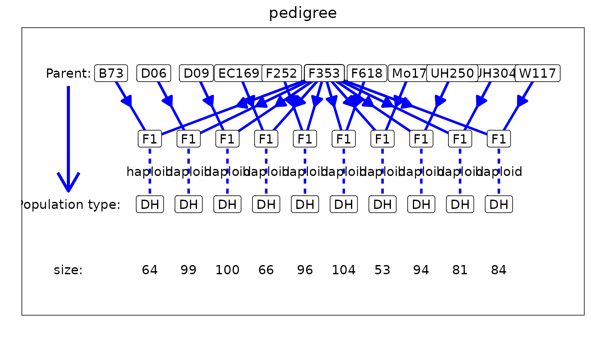

Now we can use the computed IBD probabilities to perform SQM.

``` r

## Perform Single-QTL Mapping.
maizeSQM <- selQTLMPP(MPPobj = maizeMPP,
                      trait = "mean_DtSILK",
                      maxCofactors = 0)
```

We plot the QTL profile for the SQM to get an idea of reasonable values
to use for the `threshold` and `QTLwindow` in the MQM that we do next.

``` r

## Plot QTL Profile for maize SQM.
plot(maizeSQM, plotType = "QTLProfile")
```

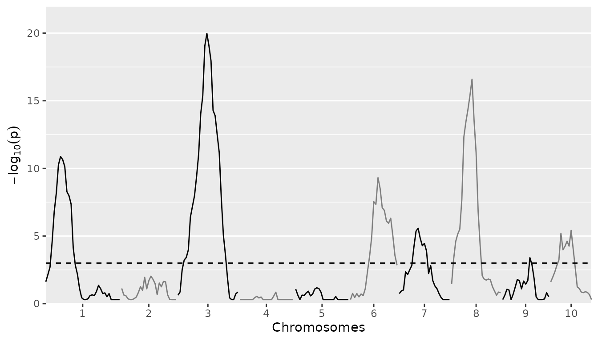

Based on the plot for the SQM the `threshold` is set to 5 to restrict a
bit the number of QTLs that will be detected in the MQM. The `QTLwindow`
is not specified and therefore left at its default value of 10cM.

``` r

## Perform Multi-QTL Mapping.
maizeMQM <- selQTLMPP(MPPobj = maizeMPP,
                      trait = "mean_DtSILK",
                      threshold = 5)
```

We only look at the combined plot of the QTL Profile and the parental
effects. This should give us the most direct insight in the QTLs found
and the effects the different parents in the crosses have.

``` r

## Plot QTL Profile for maize MQM.
plot(maizeMQM, plotType = "QTLProfileExt")
```

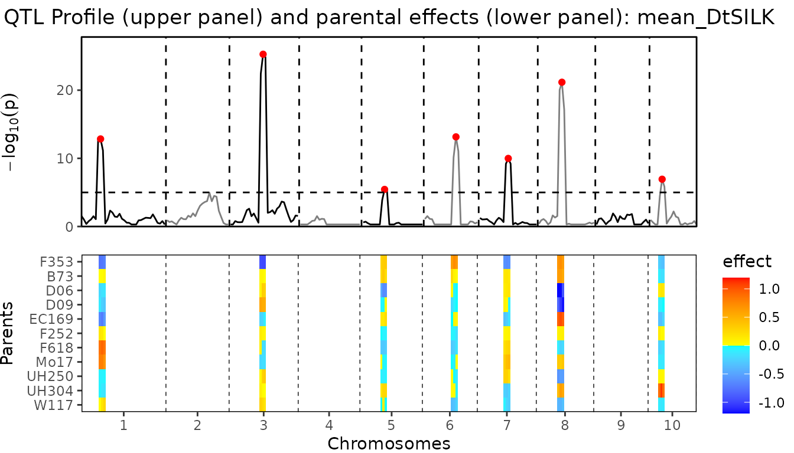

Finally we can have a look at the confidence intervals around the
parental effects for the QTLs found.

``` r

## Plot confidence intervals for parental effects for maize MQM.
plot(maizeMQM, plotType = "parCIs")
```

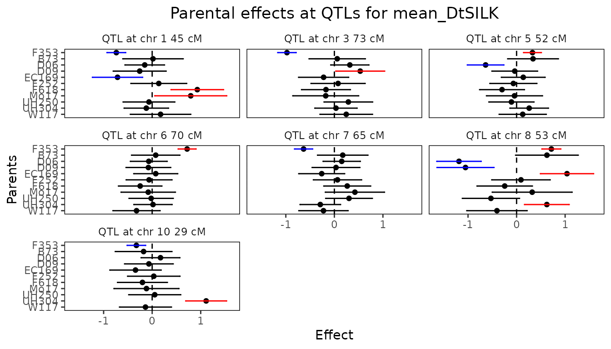

## Example barley

Instead of performing IBD calculations directly with the package, it is
also possible to import IBD probabilities computed using RABBIT software
([Zheng et al. 2014](#ref-Zheng2014), [2015](#ref-Zheng2015),
[2018](#ref-Zheng2018)). The main advantage of using RABBIT for IBD
calculations is that it can handle complex pedigree populations and
therefore can also be used in cases where the population structure is
more complex than those that can be computed using `statgenIBD`, e.g. in
the maize NAM population described before.

As an example we use a barley population described in Liller et al.
([2017](#ref-Liller2017-jz)). This MPP design consists of 5 parents.
Four wild parents were crossed with the cultivar Morex and then
backcrossed with Morex once. Individuals from the four families from the
backcrosses were then crossed with each other as in a full diallel
design, which generated six F6 families through five generations of
selfing. The trait of interest for this population is awn length
(“Awn_length”). As for the maize NAM population, the data for this
population is available in zipped format in the package.

RABBIT output can be read using the `readRABBITMPP` function in
`statgenMPP`. This has as input the standard RABBIT output summary file
and the pedigree file that needs to be provided to RABBIT as well. This
pedigree file is an optional input and is only used for plotting the
pedigree structure of the population. Without it QTL mapping can still
be performed. As for `calcIBDMPP` the phenotypic data has to be provided
as a `data.frame`. This `data.frame` has been included in the package.

``` r

## Specify files containing RABBIT output.
## Extract in a temporary directory.
tempDir <- tempdir()
inFile <- unzip(system.file("extdata/barley/barley_magicReconstruct.zip", 
                            package = "statgenMPP"), exdir = tempDir)

## Specify pedigree file.
pedFile <- system.file("extdata/barley/barley_pedInfo.csv",
                       package = "statgenMPP")

## Read phenotypic data.
data("barleyPheno")

## read RABBIT output. 
barleyMPP <- readRABBITMPP(infile = inFile,
                           pedFile = pedFile,
                           pheno = barleyPheno)
```

As for the maize example we can summarize and plot the imported data to
get a first idea of its content.

``` r

## Summary.
summary(barleyMPP)
#> map
#>  Number of markers: 355 
#>  Number of chromosomes: 7 
#> 
#> markers
#>  Number of markers: 355 
#>  Number of genotypes: 916 
#>  Parents: Morex, HID4, HID64, HID369, HID382 
#> pheno
#>  Number of traits: 1 
#>  Traitnames: Awn_length 
#>  Number of genotypes: 916 
#> 
#> crosses         
#>  50:149  
#>  51:152  
#>  52:157  
#>  53:130  
#>  54:167  
#>  55:161
```

Performing SQM and MQM for imported RABBIT output works in the same way
as for IBD probabilities computed directly in the package. Since a full
scan would take long we precomputed the results and included them in the
package.

``` r

## Perform Multi-QTL Mapping with threshold 4.
barleyMQM <- selQTLMPP(MPPobj = barleyMPP,
                       trait = "Awn_length",
                       threshold = 4)
```

There is a very large QTL on chromosome 7. To be able to more clearly
distinguish the differences between the other QTLs they are plotted
separately.

``` r

## Plot QTL Profile for barley MQM - chromosome 1-6.
plot(barleyMQM, plotType = "QTLProfileExt", chr = 1:6)
```

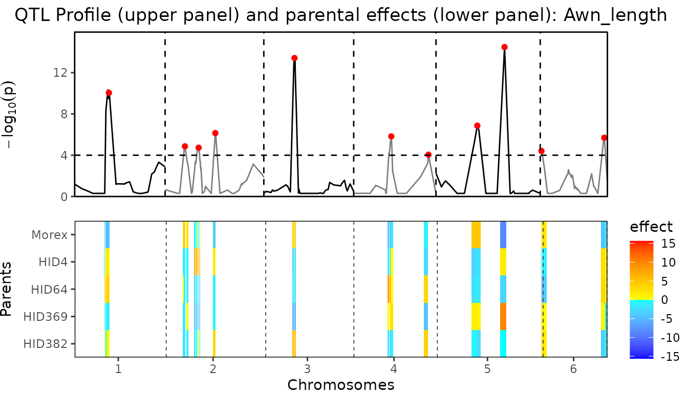

``` r

## Plot QTL Profile for barley MQM - chromosome 7.
plot(barleyMQM, plotType = "QTLProfileExt", chr = 7)
```

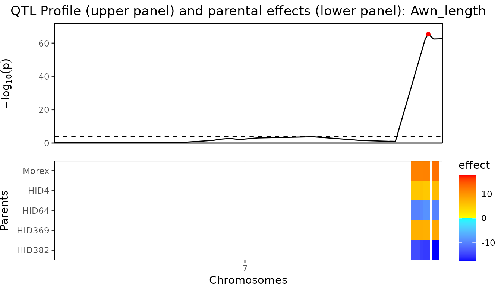

Finally we can have a look at the confidence intervals around the
parental effects for the QTLs found.

``` r

## Plot confidence intervals for parental effects for maize MQM.
plot(barleyMQM, plotType = "parCIs")
```

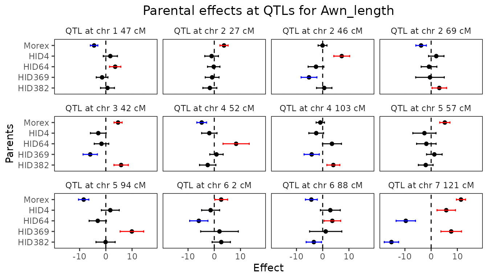

The QTLs found are very similar in both position, size and effects as
described in Liller et al. ([2017](#ref-Liller2017-jz)). This can also
be clearly seen by comparing the summary of the MQM with the table of
effects in this paper.

``` r

## Summary.
summary(barleyMQM)
#> Trait analysed: Awn_length 
#> 
#> Data are available for 355 markers.
#> Threshold: 4 
#> 
#> Number of QTLs: 12 
#> 
#>  evalPos chr    pos mrkNear minlog10p varExpl eff_Morex eff_HID4 eff_HID64 eff_HID369
#>   2_1053   1  47.06  2_1053     10.05  0.0212   -4.4815     1.72     3.563     -1.425
#>   2_1187   2  27.21  2_1187      4.86  0.0121    3.7109    -1.01    -0.200     -0.815
#>   1_1522   2  46.06  1_1522      4.73  0.0459   -0.0572     7.25    -2.554     -5.226
#>   2_0340   2  68.99  2_0340      6.14  0.0208   -3.8297     1.96    -0.811     -0.437
#>   1_1501   3  42.17  1_1501     13.42  0.0526    4.6614    -2.88    -1.654     -5.951
#>   1_1070   4  51.72  1_1070      5.83  0.0554   -4.7880    -1.89     8.331      0.844
#>   1_0611   4 102.75  1_0611      4.05  0.0299   -0.9099    -2.47     3.531     -4.200
#>   2_0645   5  56.84  2_0645      6.86  0.0268    5.2156    -2.56    -1.824      1.227
#>   1_0094   5  94.26  1_0094     14.48  0.0939   -8.4484     1.70    -3.081      9.928
#>   1_0120   6   1.67  1_0120      4.41  0.0372    2.6349    -1.39    -5.899      1.992
#>   2_0687   6  88.03  2_0687      5.70  0.0344   -4.3277     2.90     3.666      1.144
#>   1_1012   7 121.04  1_1012     65.39  0.2648   11.3779     5.77    -9.658      7.651
#>  eff_HID382 se_eff_Morex se_eff_HID4 se_eff_HID64 se_eff_HID369 se_eff_HID382
#>       0.629        0.709        1.35         1.07          1.11          1.32
#>      -1.681        0.774        1.30         1.18          1.31          1.33
#>       0.583        0.846        1.51         1.50          1.51          1.46
#>       3.119        1.002        1.47         1.49          2.72          1.39
#>       5.827        0.769        1.49         1.38          1.36          1.37
#>      -2.502        0.929        1.47         2.50          1.28          1.55
#>       4.050        0.797        1.40         1.81          1.45          1.23
#>      -2.061        0.973        2.21         1.86          1.48          1.40
#>      -0.102        0.985        1.70         1.64          2.24          1.83
#>       2.665        1.223        1.72         1.74          3.59          1.74
#>      -3.387        1.129        1.90         1.59          3.07          1.46
#>     -15.136        0.865        1.76         1.84          1.96          1.37
```

## Parallel computing

To improve performance, it is possible to use parallel computing to
perform the QTL mapping. To do this, a parallel back-end has to be
specified by the user, e.g. by using `registerDoParallel` from the
`doParallel` package (see the example below). Besides, in the
`selQTLMPP` function the argument `parallel` has to be set to `TRUE`.
With these settings the computations are done in parallel per
chromosome. Of course, this doesn’t have an effect on the output. The
MQM below gives exactly the same results as the non-parallel one
described earlier in the vignette.

``` r

## Register parallel back-end with 2 cores.
doParallel::registerDoParallel(cores = 2)

## Perform Multi-QTL Mapping.
ABCMQM_Par <- selQTLMPP(MPPobj = ABCMPP,
                        trait = "yield",
                        threshold = 3,
                        parallel = TRUE)
```

## Summary

The properties of using statgenMPP for QTL mapping in MPPs have been
shown with several examples we demonstrated here. This easy-to-use R
package, integrating the HMM method for IBD calculation and the
mixed-model approach for QTL mapping, provides us with a general
framework to estimate multi-allelic QTL effects in terms of parent
origins.

------------------------------------------------------------------------

## References

Boer, Martin P. 2023. “Tensor Product P-Splines Using a Sparse Mixed
Model Formulation.” *Statistical Modelling* 23 (5-6): 465–79.
<https://doi.org/10.1177/1471082X231178591>.

Giraud, Héloı̈se, Christina Lehermeier, Eva Bauer, et al. 2014. “Linkage
Disequilibrium with Linkage Analysis of Multiline Crosses Reveals
Different Multiallelic QTL for Hybrid Performance in the Flint and Dent
Heterotic Groups of Maize.” *Genetics* 198 (4): 1717–34.
<https://doi.org/10.1534/genetics.114.169367>.

Li, Wenhao, Martin P Boer, Bart-Jan van Rossum, Chaozhi Zheng, Ronny VL
Joosen, and Fred A Van Eeuwijk. 2022. “statgenMPP: An r Package
Implementing an IBD-Based Mixed Model Approach for QTL Mapping in a Wide
Range of Multi-Parent Populations.” *Bioinformatics* 38 (22): 5134–36.

Li, Wenhao, Martin P. Boer, Chaozhi Zheng, Ronny V. L. Joosen, and Fred
A. Van Eeuwijk. 2021. “An IBD-based mixed model approach for QTL mapping
in multiparental populations.” *Theor. Appl. Genet. 2021* 1 (August):
1–18. <https://doi.org/10.1007/S00122-021-03919-7>.

Liller, Corinna B, Agatha Walla, Martin P Boer, et al. 2017. “Fine
Mapping of a Major QTL for Awn Length in Barley Using a Multiparent
Mapping Population.” *Züchter Genet. Breed. Res.* 130 (2): 269–81.
<https://doi.org/10.1007/s00122-016-2807-y>.

Zheng, Chaozhi, Martin P Boer, and Fred A Van Eeuwijk. 2014. “A General
Modeling Framework for Genome Ancestral Origins in Multiparental
Populations.” *Genetics* 198 (1): 87–101.
<https://doi.org/10.1534/genetics.114.163006>.

Zheng, Chaozhi, Martin P Boer, and Fred A Van Eeuwijk. 2015.
“Reconstruction of Genome Ancestry Blocks in Multiparental Populations.”
*Genetics* 200 (4): 1073–87.
<https://doi.org/10.1534/genetics.115.177873>.

Zheng, Chaozhi, Martin P Boer, and Fred A Van Eeuwijk. 2018. “Recursive
Algorithms for Modeling Genomic Ancestral Origins in a Fixed Pedigree.”
*G3 Genes\|Genomes\|Genetics* 8 (10): 3231–45.
<https://doi.org/10.1534/G3.118.200340>.
